<!-- START doctoc generated TOC please keep comment here to allow auto update -->
<!-- DON'T EDIT THIS SECTION, INSTEAD RE-RUN doctoc TO UPDATE -->

**目录**

- [1 angular schematics 101 :基本内容说明](#1-angular-schematics-101-%E5%9F%BA%E6%9C%AC%E5%86%85%E5%AE%B9%E8%AF%B4%E6%98%8E)
  - [基础三问:angular schematics 是什么?有什么用?怎么用?](#%E5%9F%BA%E7%A1%80%E4%B8%89%E9%97%AEangular-schematics-%E6%98%AF%E4%BB%80%E4%B9%88%E6%9C%89%E4%BB%80%E4%B9%88%E7%94%A8%E6%80%8E%E4%B9%88%E7%94%A8)
    - [1 angular schematics 是什么?](#1-angular-schematics-%E6%98%AF%E4%BB%80%E4%B9%88)
    - [2 所以 angular schematics 只是模板代码生成器?](#2-%E6%89%80%E4%BB%A5-angular-schematics-%E5%8F%AA%E6%98%AF%E6%A8%A1%E6%9D%BF%E4%BB%A3%E7%A0%81%E7%94%9F%E6%88%90%E5%99%A8)
    - [3.简单上手 angular schematics：创建一个 hello](#3%E7%AE%80%E5%8D%95%E4%B8%8A%E6%89%8B-angular-schematics%E5%88%9B%E5%BB%BA%E4%B8%80%E4%B8%AA-hello)
- [2 angular schematics 实现 ng generator 使用模板生成组件](#2-angular-schematics-%E5%AE%9E%E7%8E%B0-ng-generator-%E4%BD%BF%E7%94%A8%E6%A8%A1%E6%9D%BF%E7%94%9F%E6%88%90%E7%BB%84%E4%BB%B6)
  - [0、准备工作](#0%E5%87%86%E5%A4%87%E5%B7%A5%E4%BD%9C)
  - [1 实现创建通用 component 组件](#1-%E5%AE%9E%E7%8E%B0%E5%88%9B%E5%BB%BA%E9%80%9A%E7%94%A8-component-%E7%BB%84%E4%BB%B6)
    - [1.1 创建 component 文件模板 template](#11-%E5%88%9B%E5%BB%BA-component-%E6%96%87%E4%BB%B6%E6%A8%A1%E6%9D%BF-template)
    - [1.2 配置 schema.json,定义该原理图可用选项](#12-%E9%85%8D%E7%BD%AE-schemajson%E5%AE%9A%E4%B9%89%E8%AF%A5%E5%8E%9F%E7%90%86%E5%9B%BE%E5%8F%AF%E7%94%A8%E9%80%89%E9%A1%B9)
    - [1.3 创建 schema.d.ts,定义的各个选项的值](#13-%E5%88%9B%E5%BB%BA-schemadts%E5%AE%9A%E4%B9%89%E7%9A%84%E5%90%84%E4%B8%AA%E9%80%89%E9%A1%B9%E7%9A%84%E5%80%BC)
    - [1.4 编写规则工厂逻辑代码](#14-%E7%BC%96%E5%86%99%E8%A7%84%E5%88%99%E5%B7%A5%E5%8E%82%E9%80%BB%E8%BE%91%E4%BB%A3%E7%A0%81)
    - [1.5 编写测试用例测试代码](#15-%E7%BC%96%E5%86%99%E6%B5%8B%E8%AF%95%E7%94%A8%E4%BE%8B%E6%B5%8B%E8%AF%95%E4%BB%A3%E7%A0%81)
    - [1.6 实际 angular 项目运行](#16-%E5%AE%9E%E9%99%85-angular-%E9%A1%B9%E7%9B%AE%E8%BF%90%E8%A1%8C)
- [3 angular schematics 实现 ng add 指令安装模块](#3-angular-schematics-%E5%AE%9E%E7%8E%B0-ng-add-%E6%8C%87%E4%BB%A4%E5%AE%89%E8%A3%85%E6%A8%A1%E5%9D%97)
  - [1 创建 ng add 的 schema.json 并配置](#1-%E5%88%9B%E5%BB%BA-ng-add-%E7%9A%84-schemajson-%E5%B9%B6%E9%85%8D%E7%BD%AE)
  - [2 生成并导出 schema.d.ts 文件](#2-%E7%94%9F%E6%88%90%E5%B9%B6%E5%AF%BC%E5%87%BA-schemadts-%E6%96%87%E4%BB%B6)
  - [3 编写规则工厂实现逻辑代码](#3-%E7%BC%96%E5%86%99%E8%A7%84%E5%88%99%E5%B7%A5%E5%8E%82%E5%AE%9E%E7%8E%B0%E9%80%BB%E8%BE%91%E4%BB%A3%E7%A0%81)
  - [4 测试并使用](#4-%E6%B5%8B%E8%AF%95%E5%B9%B6%E4%BD%BF%E7%94%A8)
- [4 angular schematics 实现 ng update 更新模块时修改指定组件内容](#4-angular-schematics-%E5%AE%9E%E7%8E%B0-ng-update-%E6%9B%B4%E6%96%B0%E6%A8%A1%E5%9D%97%E6%97%B6%E4%BF%AE%E6%94%B9%E6%8C%87%E5%AE%9A%E7%BB%84%E4%BB%B6%E5%86%85%E5%AE%B9)
  - [1、创建 migration.json 文件](#1%E5%88%9B%E5%BB%BA-migrationjson-%E6%96%87%E4%BB%B6)
  - [2 在 package.json 中声明 ug-update 配置](#2-%E5%9C%A8-packagejson-%E4%B8%AD%E5%A3%B0%E6%98%8E-ug-update-%E9%85%8D%E7%BD%AE)
  - [3 编写更新执行的规则工厂逻辑代码](#3-%E7%BC%96%E5%86%99%E6%9B%B4%E6%96%B0%E6%89%A7%E8%A1%8C%E7%9A%84%E8%A7%84%E5%88%99%E5%B7%A5%E5%8E%82%E9%80%BB%E8%BE%91%E4%BB%A3%E7%A0%81)
  - [4 测试并使用](#4-%E6%B5%8B%E8%AF%95%E5%B9%B6%E4%BD%BF%E7%94%A8-1)
- [5 将原理图 package 发布并使用](#5-%E5%B0%86%E5%8E%9F%E7%90%86%E5%9B%BE-package-%E5%8F%91%E5%B8%83%E5%B9%B6%E4%BD%BF%E7%94%A8)
  - [1 使用 npm link 本地调试](#1-%E4%BD%BF%E7%94%A8-npm-link-%E6%9C%AC%E5%9C%B0%E8%B0%83%E8%AF%95)
  - [2 将原理图 package 发布到仓库并使用](#2-%E5%B0%86%E5%8E%9F%E7%90%86%E5%9B%BE-package-%E5%8F%91%E5%B8%83%E5%88%B0%E4%BB%93%E5%BA%93%E5%B9%B6%E4%BD%BF%E7%94%A8)
    - [1、添加帐号，在终端输入 adduser，按提示填写](#1%E6%B7%BB%E5%8A%A0%E5%B8%90%E5%8F%B7%E5%9C%A8%E7%BB%88%E7%AB%AF%E8%BE%93%E5%85%A5-adduser%E6%8C%89%E6%8F%90%E7%A4%BA%E5%A1%AB%E5%86%99)
    - [2、在根目录执行`npm publish`](#2%E5%9C%A8%E6%A0%B9%E7%9B%AE%E5%BD%95%E6%89%A7%E8%A1%8Cnpm-publish)
    - [3 发布 0.0.2 版本的包](#3-%E5%8F%91%E5%B8%83-002-%E7%89%88%E6%9C%AC%E7%9A%84%E5%8C%85)
    - [4 实际测试使用](#4-%E5%AE%9E%E9%99%85%E6%B5%8B%E8%AF%95%E4%BD%BF%E7%94%A8)
- [总结](#%E6%80%BB%E7%BB%93)

<!-- END doctoc generated TOC please keep comment here to allow auto update -->

# 1 angular schematics 101 :基本内容说明

## 基础三问:angular schematics 是什么?有什么用?怎么用?

### 1 angular schematics 是什么?

首先要知道什么是 schematics(原理图):
angular 官方文档说明:

> ①: 原理图是一个基于模板的支持复杂逻辑的代码生成器。它是一组通过生成代码或修改代码来转换软件项目的指令。 原理图会打包成集合（collection）并用 npm 安装。  
> ②: 原理图的集合可以作为一个强大的工具，以创建、修改和维护任何软件项目，特别是当要自定义 Angular 项目以满足你自己组织的特定需求时。例如，你可以借助原理图来用预定义的模板或布局生成常用的 UI 模式或特定的组件。你也可以使用原理图来强制执行架构规则和约定，让你的项目保持一致性和互操作性。

所以 **简单来讲,angular schematics 就是 angular 生态圈中,针对 angular 项目的代码生成器。**

### 2 所以 angular schematics 只是模板代码生成器?

不可否则,schematics 最主要的作用就是代码生成器.有很多模板代码结构内容都是一样的,例如 component,每次新建一个 component,都需要复制上一份的代码进行修改.

angular-cli 默认有一些可以按照模板生成的组件,例如 componet、router、service、interceptor 等等，这也是很多插件工具一键生成模板代码的依据。但是并不是所有代码都适合所有开发者。例如有些使用者常与 CURD 打交道，所以希望生成的 service 直接包含所有的 CRUD 函数，输入不同的名称对应生成不同产品。等等各自自适应、自构建的模板。

除此之外，它还能用于按照一定规则修改程式代码、快速按照所需模块等，就如引用的 angular 官方文档说明的第 ② 点。毕竟至少对应到了 ng generate 、 ng add 和 ng update 指令。

### 3.简单上手 angular schematics：创建一个 hello

1、全局安装 schematics cli（需要 node 6.9 以上版本）

```
npm install -g @angular-devkit/schematics-cli
```

安装完成之后，可以在终端输入`schmatics`命令，能显示 schematics 的指令说明则表示安装成功。

2、创建一个空的原理图

```
schematics blank --name=hello
```

生成的原理图中基本内容结构可参看官网说明[集合的内容](https://angular.cn/guide/schematics-authoring#collection-contents)和[命名原理图](https://angular.cn/guide/schematics-authoring#named-schematics)  
简单说明如下：  
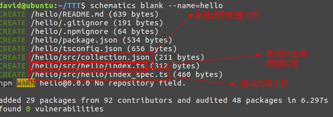
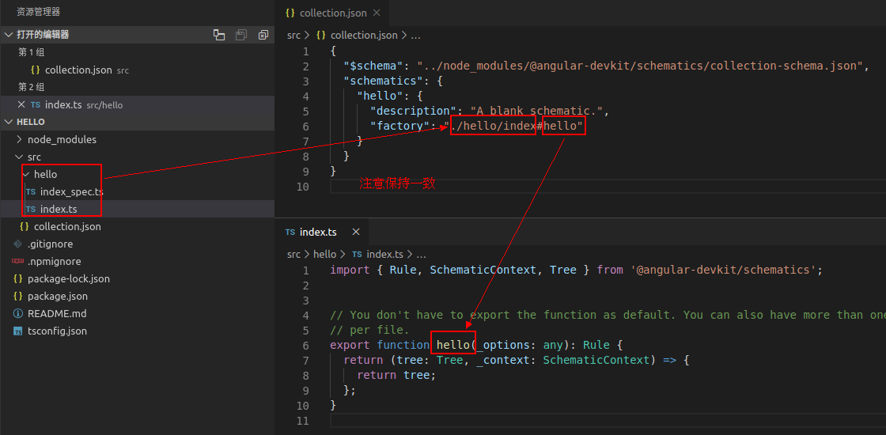

collection.json 配置一般一个原理图就只配置一次，所以大部分内容都是在 index.ts 中实现，所以，一定先清楚这个文件的内容：
具体可以参看官方说明[原理图的概念](https://angular.cn/guide/schematics-authoring#schematics-concepts)  
简单说明如下：  
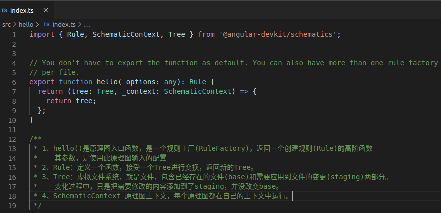

3、运行原理图
因为创建的是一个空白原理图，运行是不会有任何输出显示的。

3.1 在当前位置运行：
先构建：

```
npm run build
```

再运行

```
schematics .:hello
```

简单说明：  
ts 代码在编译之后转换成 js 代码才能运行，在原理图中，在执行`npm run build`之后，
会出现其他的 XXX.d.ts、XXX.js、XXX.js.map。  
运行时，`.:hello`的`.`是当前位置，`hello`则是在 collection.json 中配置的原理图的名字。  
当然，一份 collection.json 中可以配置多个原理图，所以要指定使用的是哪一个。

"Nothing to be done."显然没有任何意义，我们可以在 index.ts 中加入一句打印，看看效果：

```
export function hello(_options: any): Rule {
  return (tree: Tree, _context: SchematicContext) => {
    console.log("hello");
    return tree;
  };
}
```

那么再次编译运行之后，就可以看到输入的是：

```
david@ubuntu:~/TTT/hello$ schematics .:hello
hello
Nothing to be done.
david@ubuntu:~/TTT/hello$
```

3.2 在相对路劲下运行
如果现在不在 hello 下运行了，那么就不能直接.:<schematics-name>了，需要找到该原理图的 collection.json 文件，并指定使用哪一个。  
例如在 hello 同级目录下新建个 test 文件夹，在 test 中运行则是：

```
david@ubuntu:~/TTT/test$ schematics ../hello/src/collection.json:hello
hello
Nothing to be done.
david@ubuntu:~/TTT/test$
```

以上就是 angular schematics 的基础说明和运行，是不是毫无实际意义？没错。接下来，我们开始进入有点实际作用的内容。

# 2 angular schematics 实现 ng generator 使用模板生成组件

本节会实现，在 angular 项目中，使用 ng generator 指令生成一个通用的 component 组件，和一般向后台请求数据需要包含 CRUD 函数的 service 组件。here we go。

## 0、准备工作

新建一个空白 schematics，如下：

```
schematics blank --name=angular-schematics-tutorial
```

将原本的内容：

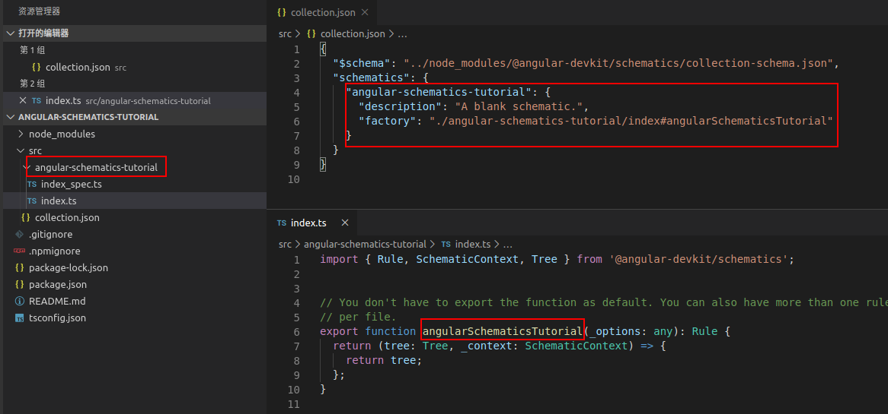

修改为：

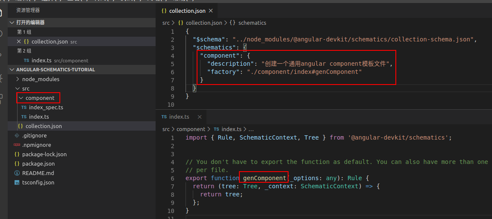  
为了方便，不用每次修改都运行 build，在此项目的 package.json 的 script 加入一行：

```
"build:watch": "tsc -p tsconfig.json --watch"
```

使得该项目一致在 watch 状态下，然后运行

```
npm run build:watch
```

准备工作完成，进入正题。

## 1 实现创建通用 component 组件

一般每个命令原理图都包含以下内容：

> index.ts： 定义命名原理图中转换逻辑的代码。  
> schema.json： 原理图变量定义。  
> schema.d.ts： 原理图变量。  
> files/： 要复制的可选组件/模板文件。

我们的也不例外。

### 1.1 创建 component 文件模板 template

一般 angular component 会包含 4 个文件：XXX.html，XXX.scss，XXX.spec.ts，XXX.ts。所以，先准备好这些模板。

在/component 文件夹下新建 files 文件夹，并创建以下 4 个文件，效果如下：

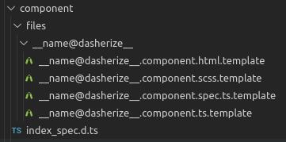

简单说明两个函数：

> classify() 方法接受一个值，并返回标题格式（title case）的值。比如，如果提供的名字是 my service，它就会返回 MyService。  
> dasherize() 方法接受一个值，并以中线分隔并小写的形式返回值。比如，如果提供的名字是 MyService，它就会返回 “my-service” 的形式。

此 component 模块的效果就是，在新建一个 component 时，输入 component 的名字，例如 apple，则会在该 angular 项目的 src/app/下，新建一个文件夹 apple，下面 4 个文件 apple.component.html， apple.component.scss，apple.component.spec.ts，apple.component.ts。

模板内容分别如下：  
`__name@dasherize__.component.html.template文件：`

```
<p>
  <%= dasherize(name) %> works!
</p>

```

`__name@dasherize__.component.spec.ts.template文件：`

```
/* tslint:disable:no-unused-variable */
import { async, ComponentFixture, TestBed } from '@angular/core/testing';
import { By } from '@angular/platform-browser';
import { DebugElement } from '@angular/core';

import { <%= classify(name) %>Component } from './<%= dasherize(name) %>.component';

describe('<%= classify(name) %>Component', () => {
  let component: <%= classify(name) %>Component;
  let fixture: ComponentFixture<<%= classify(name) %>Component>;

  beforeEach(async(() => {
    TestBed.configureTestingModule({
      declarations: [<%= classify(name) %>Component]
    })
      .compileComponents();
  }));

  beforeEach(() => {
    fixture = TestBed.createComponent(<%= classify(name) %>Component);
    component = fixture.componentInstance;
    fixture.detectChanges();
  });

  it('should create', () => {
    expect(component).toBeTruthy();
  });
});
```

`__name@dasherize__.component.ts.template文件：`

```
import { Component, OnInit } from '@angular/core';

@Component({
  selector: 'app-<%= dasherize(name) %>',
  templateUrl: './<%= dasherize(name) %>.component.html',
  styleUrls: ['./<%= dasherize(name) %>.component.scss']
})
export class <%=classify(name)%>Component implements OnInit {

  constructor() { }

  ngOnInit() {
  }
}
```

scss 部分就没有必要了。  
此部分内容，可参考 angular-cli 源代码内容：[angular-cli component 组件模板](https://github.com/angular/angular-cli/tree/master/packages/schematics/angular/component/files/__name%40dasherize%40if-flat__)

### 1.2 配置 schema.json,定义该原理图可用选项

在 component 文件夹下新建 schema.json，并输入以下内容：

```
{
    "$schema": "http://json-schema.org/schema",
    "id": "componentSchema",
    "title": "component options schema.",
    "type": "object",
    "descripiton": "创建一个component范本",
    "properties": {
        "name": {
            "description": "component的名字.",
            "type": "string",
            "$default": {
                "$source": "argv",
                "index": 0
            },
            "x-prompt": "你想创建的component的名字:"
        }
    },
    "required": [
        "name"
    ]
}
```

属性说明：

> id：这个模式定义在集合中的唯一 id。  
> title：一个人类可读的模式描述。  
> type：由这些属性提供的类型描述符。  
> properties：一个定义该原理图可用选项的对象。  
> required：必填的选项

注意属性(proerties)选项：  
　　\$default 的设定，上面的表示，如果没有指定输入的选项，那么输入的第一个就是 name  
　　 x-prompt：如果没有输入选项，则提示语提示输入

**创建好 schema.json 之后，一定要记得在 collection.json 中配置 schema 属性**

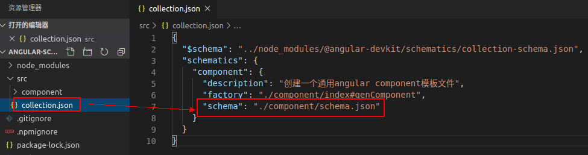

### 1.3 创建 schema.d.ts,定义的各个选项的值

一般的，可以手动创建 schema.d.ts，如本生成 component 的原理图，它的 schema.json 中属性只有一个必填的 name，那么编写的 schema.d.ts 内容就如下：

```
export interface Schema {
    name: string;
}
```

实际上，这个文件可以使用指令生成，在 schema.json 的同级目录下，开启终端输入指令，如下：

```
npx -p dtsgenerator dtsgen schema.json -o schema.d.ts
```

效果如下  
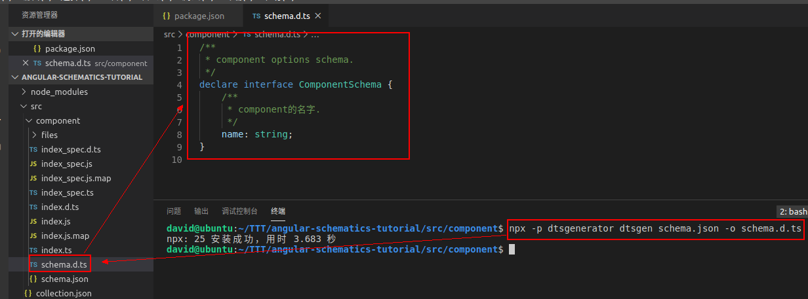

但注意，**生成之后把 declare 改成 export**，因为需要把这接口导出使用。

### 1.4 编写规则工厂逻辑代码

以上都定义完之后，便到了最重要的环节，编写逻辑代码实现 componet 组件的生成。

简单分析，至少我们有以下几步工作需要完成：  
第一步：判断目标项目是不是 angular 项目。如果不在 angular 项目中去生成 angular 的 componet，那就没什么意义。这一步可以提出来通用。  
　　同理，@schematics 对 angular 有很多的已有支持，我们这里可以用到一些便捷的方法，所以需要先安装@schematics/angular，输入指令如下：

```
npm install @schematics/angular -S
```

第二步：读取预设的模板 template 文件，并将使用者输入选项应用到模板。  
第三步：合并模板文件，返回新的 tree。

修改 index.ts 代码具体如下：

```
import {
  Rule, SchematicContext, Tree,
  apply, mergeWith, url,
  move,
  applyTemplates, SchematicsException
} from '@angular-devkit/schematics';
import { strings } from '@angular-devkit/core';

import { ComponentSchema as Schema } from './schema'

import { buildDefaultPath } from '@schematics/angular/utility/project';
import { parseName } from '@schematics/angular/utility/parse-name';

export function genComponent(_options: Schema): Rule {
  return (tree: Tree, _context: SchematicContext) => {

    // 获取到在angular cli工作区下的 路劲和要生成的组件 前缀name
    const { name, path } = getParsePath(tree, _options);

    // 读取模板文件
    const sourceTemplates = url('./files');

    // 应用模板文件
    const sourceParametrizedTemplates = apply(sourceTemplates, [
      applyTemplates({
        ..._options,
        ...strings,
        name
      }),
      move(path)
    ]);

    // 将传入的值(option)与模板文件合并(传入值替代模板变量值)
    return mergeWith(sourceParametrizedTemplates)(tree, _context);
  };
}

function getParsePath(tree: Tree, options: any): any {

  // 读取angular.json文件并存为buffer
  const workspaceConfigBuffer = tree.read("angular.json")

  // 判断是不是在一个angular-cli工作区
  if (!workspaceConfigBuffer) {
    throw new SchematicsException('不在angular cli工作区,请在angular项目中执行!')
  }

  // 读取并整理angular配置
  const workspaceConfig = JSON.parse(workspaceConfigBuffer.toString());
  // 有传入project属性或者是默认project
  const projectName = options.project || workspaceConfig.defaultProject;
  // 获取project定义
  const project = workspaceConfig.projects[projectName];

  // 获取默认project路径
  const defaultProjectPath = buildDefaultPath(project);

  // parseName()可以把路径和文件名拆开,取得path和name
  // 例如 src/feartures/login,会被拆分为 path:src/features 和 name:login
  const parsePath = parseName(defaultProjectPath, options.name);

  return parsePath;
}
```

像上述的`buildDefaultPath`，`parseName`方法就是@schematics/angular 中提供的。

### 1.5 编写测试用例测试代码

这个测试方面的内容也是个大项，这里就不多说明，简单说一下我们的测试用例。  
我的测试就是模拟生成一个 angular 项目，然后看看是否在里面生成了 component 的那 4 个文件，若有生成，那么通过，否则就失败。
修改 index_spec.ts 代码如下：

```
import * as path from 'path';

import { SchematicTestRunner, UnitTestTree } from '@angular-devkit/schematics/testing';
import { Schema as ApplicationOptions, Style } from '@schematics/angular/application/schema';
import { Schema as WorkspaceOptions } from '@schematics/angular/workspace/schema';
import { strings } from '@angular-devkit/core';

const collectionPath = path.join(__dirname, '../collection.json');

describe('component', () => {

  // 选项 --name的值
  const name = 'apple';
  const runner = new SchematicTestRunner('schematics', collectionPath);

  // 模拟ng new创建angular项目，主要对workspace和application进行配置

  // angular项目的配置
  const workspaceOptions: WorkspaceOptions = {
    name: 'workspace',              // 不重要的名字，随意取，不影响测试结果
    newProjectRoot: 'projects',     // 项目app的根目录，可以随意取，但是验证会用到
    version: '6.0.0',               // 版本号，随意，不影响测试
  };
  const appOptions: ApplicationOptions = {
    name: 'component',              // 项目名称
    inlineStyle: false,             // 以下是项目属性，随意true/false，不影响测试结果
    inlineTemplate: false,
    routing: false,
    style: Style.Css,
    skipTests: false,
    skipPackageJson: false,
  };

  // 调用 SchematicTestRunner 的 runExternalSchematicAsync 方法，并以给出的参数生成angular项目
  let appTree: UnitTestTree;

  beforeEach(async () => {
    appTree = await runner.runExternalSchematicAsync(
      '@schematics/angular',
      'workspace',
      workspaceOptions
    ).toPromise();
    appTree = await runner.runExternalSchematicAsync(
      '@schematics/angular',
      'application',
      appOptions,
      appTree
    ).toPromise();
  });


  // 最基本的判断,如果生成的文件名和预期生成的文件名一致,就验证成功
  it('works', async () => {

    // runSchematicAsync()参数：项目名、参数、Tree
    const tree = await runner.runSchematicAsync('component', { name }, appTree).toPromise();

    const dasherizeName = strings.dasherize(name);

    /* 以下其实可以直接4个toContain代替*/
    // 预期生成的文件
    const expectFiles = [
      `/projects/component/src/app/${dasherizeName}/${dasherizeName}.component.ts`,
      `/projects/component/src/app/${dasherizeName}/${dasherizeName}.component.html`,
      `/projects/component/src/app/${dasherizeName}/${dasherizeName}.component.scss`,
      `/projects/component/src/app/${dasherizeName}/${dasherizeName}.component.spec.ts`,
    ]

    // 如果实际模拟的angular项目中拥有预期生成的文件,则将它从expectFiles中移除
    for (const v of tree.files) {
      for (let i = 0; i < expectFiles.length; i++) {
        const e = expectFiles[i];
        if (v.toString() === e) {
          expectFiles.splice(i, 1);
        }
      }
    }

    //如果预期生成的文件都有生成,那么预期的应该是0=0成立
    expect(0).toEqual(expectFiles.length);
  });
});
```

运行测试用例就很简单了，直接`npm run test`，如果测试成功，终端应该如下输出：

```
david@ubuntu:~/TTT/angular-schematics-tutorial$ npm run test

> angular-schematics-tutorial@0.0.0 test /home/david/TTT/angular-schematics-tutorial
> npm run build && jasmine src/**/*_spec.js


> angular-schematics-tutorial@0.0.0 build /home/david/TTT/angular-schematics-tutorial
> tsc -p tsconfig.json

Randomized with seed 66156
Started
.


1 spec, 0 failures
Finished in 0.369 seconds
Randomized with seed 66156 (jasmine --random=true --seed=66156)
david@ubuntu:~/TTT/angular-schematics-tutorial$
```

### 1.6 实际 angular 项目运行

测试用例通过可能很好，但最好还是去实际项目中测试一下，向生成一个 angular 项目：

```
ng new angular-demo
```

在该 angular-demo 项目中运行指令`angular-demo$ schematics ../angular-schematics-tutorial/src/`，可以看到结果如下：

```
david@ubuntu:~/TTT/angular-demo$ schematics ../angular-schematics-tutorial/src/collection.json:component --debug=false
? 你想创建的component的名字: comp/apple
CREATE /src/app/comp/apple/apple.component.html (23 bytes)
CREATE /src/app/comp/apple/apple.component.scss (0 bytes)
CREATE /src/app/comp/apple/apple.component.spec.ts (755 bytes)
CREATE /src/app/comp/apple/apple.component.ts (607 bytes)
david@ubuntu:~/TTT/angular-demo$
```

简单说明：
**其中指令 --debug=false 是为了实际生成文件，如果不加这一句，不会生成实际的文件。**  
因为没有直接输入`--name=comp/apple`或者直接`comp/apple`,所以出现了输入提示语。直接输入 `schematics ../angular-schematics-tutorial/src/collection.json:component --name=comp/apple --debug=false`则不会出现提示语。

注意：如果已有同位置同名文件，再次生成会报错，提示`already exists.`。

我们查看生成的 component 组件模块内容：  
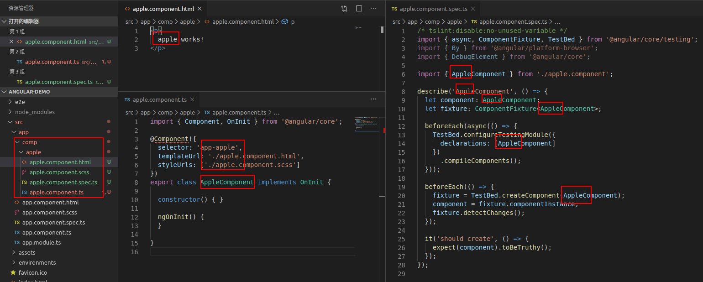

可以看到，文件有实际生成，模板内容有被替换。

恭喜，如果到这里都正确，那么已经完成了自定义原理图的制作和使用了。

所以，想要生成一个具有 CRUD 函数的 service 步骤效果就是一样的，不再赘述，具体可参看代码。

理论上，一个原理图项目(schematics)可以有很多个原理图(schematic)，但是要在 collection 中统一指定配置。

总结制作原理图的一般步骤：  
　　 1、新建原理图使用模板文件；  
　　 2、创建该原理图需要的 schema.json 并将该原理图配置到 collection.json；  
　　 3、依照 schema.json 创建接口 schema.d.ts；  
　　 4、在 index.ts 中编写实现该原理图目的的逻辑代码；  
　　 5(非必须)、编写测试用例进行测试；  
　　 6(测试)、利用测试用例或实际项目进行测试。

# 3 angular schematics 实现 ng add 指令安装模块

ng add 有什么用？

> 将对外部库的支持添加到您的项目中。

如何使用？

> ng add <collection> [options]

但是实际上，这个能够直接使用 ng add 也是应该这个需要添加的库，内部实现了对此原理图的功能。

举个例子，众所周知，angular material 可以直接使用 ng add 添加到已有的 angular 专案。执行`ng add @angular/material`。

效果如下：

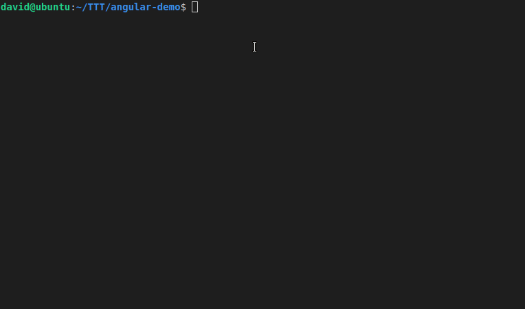

但是，如果我想添加 Font Awesome 到 angular 项目，你就需要

```
npm install @fortawesome/fontawesome-svg-core
npm install @fortawesome/free-solid-svg-icons
npm install @fortawesome/angular-fontawesome@<version>
```

然后手动引入模块,声明使用等等操作。

为什么不能使用 ng add？  
你看：  
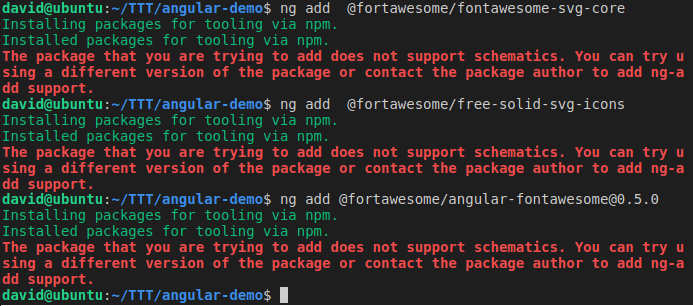。

font awesome 不支持直接的 ng add,因为 package 中没有实现导入等作业，所以只执行了安装。

所以本节的目标，就是编写一个原理图，实现 ng add 的时候  
1、一次性安装以上 3 个 package，  
2、在 app.module.ts 中引入 FontAwesomeModule  
3、在 app.component.ts 声明并在 app.component.html 实例化。

## 1 创建 ng add 的 schema.json 并配置

在与之前 component 文件夹同级的路径下，创建 ng-add 文件夹。

在 ng-add 文件夹下创建 schema.json 文件，并编写如下内容：

```
{
    "$schema": "http://json-schema.org/schema",
    "id": "NgAddSchema",
    "title": "Ng-Add Schema",
    "type": "object",
    "description": "给angular项目添加 Font-Awesome。",
    "properties": {
        "project": {
            "type": "string",
            "description": "给angular项目添加 Font-Awesome。"
        }
    }
}
```

在 collection.json 中的 "schematics"添加子项，内容如下：

```
"ng-add": {
  "description": "给angular项目中添加 Font-Awesome库。",
  "factory": "./ng-add",
  "schema": "./ng-add/schema.json"
}
```

注意名称保持 ng-add。

## 2 生成并导出 schema.d.ts 文件

schema.d.ts 文件内容大概如下：

```
/**
 * Ng-Add Schema
 * 给angular项目添加 Font-Awesome。
 */
export interface NgAddSchema {
    /**
     * 给angular项目添加 Font-Awesome。
     */
    project?: string;
}
```

## 3 编写规则工厂实现逻辑代码

在文件夹 ng-add 下新建 index.ts 文件，并写入以下代码：

```
import { Rule, SchematicContext, Tree, SchematicsException } from '@angular-devkit/schematics';
import { buildDefaultPath } from '@schematics/angular/utility/project';
import { NodePackageInstallTask } from '@angular-devkit/schematics/tasks';
import { NgAddSchema } from './schema';
import { addImportToModule } from '@schematics/angular/utility/ast-utils';
import { InsertChange } from '@schematics/angular/utility/change';

import * as ts from '@schematics/angular/third_party/github.com/Microsoft/TypeScript/lib/typescript';

export default function (_options: NgAddSchema): Rule {
    return (_tree: Tree, _context: SchematicContext) => {

        // 如果不是 Angular 项目则抛出错误
        const workspaceConfigBuffer = _tree.read('angular.json');
        if (!workspaceConfigBuffer) {
            throw new SchematicsException('Not an Angular CLI workspace');
        }

        // 取得 project 的根目录
        const workspaceConfig = JSON.parse(workspaceConfigBuffer.toString());
        const projectName = _options.project || workspaceConfig.defaultProject;
        const project = workspaceConfig.projects[projectName];
        const defaultProjectPath = buildDefaultPath(project);


        //将 FortAwesomeModule 加入 AppModule
        const modulePath = `${defaultProjectPath}/app.module.ts`;
        const sourceFile = readIntoSourceFile(_tree, modulePath);

        const importPath = '@fortawesome/angular-fontawesome';
        const moduleName = 'FontAwesomeModule';
        const declarationChanges = addImportToModule(sourceFile, modulePath, moduleName, importPath);

        const declarationRecorder = _tree.beginUpdate(modulePath);
        for (const change of declarationChanges) {
            if (change instanceof InsertChange) {
                declarationRecorder.insertLeft(change.pos, change.toAdd);
            }
        }
        _tree.commitUpdate(declarationRecorder);

        // 将某个 icon 引入到 app.component.ts，再到 app.component.html 中使用它。（声明并实例化）

        // 获取 app.component.ts 的 AST
        const componentPath = `${defaultProjectPath}/app.component.ts`;
        const componentSourceFile = readIntoSourceFile(_tree, componentPath);

        // 取得所有的 ImpotDeclaration
        const allImports = componentSourceFile.statements.filter(node => ts.isImportDeclaration(node))! as ts.ImportDeclaration[];

        // 找到最后一个 ImpotDeclaration
        let lastImport: ts.Node | undefined;
        for (const importNode of allImports) {
            if (!lastImport || importNode.getStart() > lastImport.getStart()) {
                lastImport = importNode;
            }
        }

        // 找到 ClassDeclaration
        const classDeclaration = componentSourceFile.statements.find(node => ts.isClassDeclaration(node))! as ts.ClassDeclaration;

        // 取得所有的 property
        const allProperties = classDeclaration.members.filter(node => ts.isPropertyDeclaration(node))! as ts.PropertyDeclaration[];

        // 取得最后一个 propery
        let lastProperty: ts.Node | undefined;
        for (const propertyNode of allProperties) {
            if (!lastProperty || propertyNode.getStart() > propertyNode.getStart()) {
                lastProperty = propertyNode;
            }
        }

        const componentRecorder = _tree.beginUpdate(componentPath);
        const importFaCoffee = '\nimport { faCoffee } from \'@fortawesome/free-solid-svg-icons\';';
        componentRecorder.insertLeft(lastImport!.end, importFaCoffee);

        // 添加声明部分的代码
        const faCoffeeProperty = 'faCoffee = faCoffee;'
        const changeText = lastProperty ? lastProperty.getFullText() : '';
        let toInsert = '';
        if (changeText.match(/^\r?\r?\n/)) {
            toInsert = `${changeText.match(/^\r?\n\s*/)![0]}${faCoffeeProperty}`;
        } else {
            toInsert = `\n  ${faCoffeeProperty}\n`;
        }

        // 插入字串
        if (lastProperty) {
            componentRecorder.insertLeft(lastProperty!.end, toInsert);
        } else {
            componentRecorder.insertLeft(classDeclaration.end - 1, toInsert);
        }

        _tree.commitUpdate(componentRecorder);

        //在 app.component.html 里面加上 <fa-icon [icon]="faCoffee"></fa-icon> ：
        const htmlPath = `${defaultProjectPath}/app.component.html`;
        const htmlStr = `\n<fa-icon [icon]="faCoffee"></fa-icon>\n`;
        const htmlSourceFile = readIntoSourceFile(_tree, htmlPath);
        const htmlRecorder = _tree.beginUpdate(htmlPath);
        htmlRecorder.insertLeft(htmlSourceFile.end, htmlStr);
        _tree.commitUpdate(htmlRecorder);

        // 修改 package.json
        const dependencies = [
            { name: '@fortawesome/fontawesome-svg-core', version: '~1.2.25' },
            { name: '@fortawesome/free-solid-svg-icons', version: '~5.11.2' },
            { name: '@fortawesome/angular-fontawesome', version: '~0.5.0' }
        ];
        dependencies.forEach(dependency => {
            addPackageToPackageJson(
                _tree,
                dependency.name,
                dependency.version
            );
        });

        // 使用 Schematic安装3个依赖 Package 。
        // 使用Angular Schematics 的 API - NodePackageInstallTask 。
        _context.addTask(
            new NodePackageInstallTask({
                packageName: dependencies.map(d => d.name).join(' ')
            })
        );

        return _tree;

    };
};

//读取文件
function readIntoSourceFile(host: Tree, modulePath: string): ts.SourceFile {
    const text = host.read(modulePath);
    if (text === null) {
        throw new SchematicsException(`File ${modulePath} does not exist.`);
    }
    const sourceText = text.toString('utf-8');
    return ts.createSourceFile(modulePath, sourceText, ts.ScriptTarget.Latest, true);
}

// 给package.json添加依赖包
function addPackageToPackageJson(host: Tree, pkg: string, version: string): Tree {
    if (host.exists('package.json')) {
        const sourceText = host.read('package.json')!.toString('utf-8');
        const json = JSON.parse(sourceText);
        if (!json.dependencies) {
            json.dependencies = {};
        }
        if (!json.dependencies[pkg]) {
            json.dependencies[pkg] = version;
            json.dependencies = sortObjectByKeys(json.dependencies);
        }
        host.overwrite('package.json', JSON.stringify(json, null, 2));
    }
    return host;
}

// 对象key排序
function sortObjectByKeys(obj: any) {
    return Object.keys(obj).sort().reduce((result, key) => (result[key] = obj[key]) && result, {} as any);
}
```

代码不用细读，大约做了以下几件事：

1、判断是不是 angular 项目  
2、获取 angular.json 中参数配置  
3、在 app.module.ts 中引入 FontAwesomeModule  
4、在 app.component.ts 声明一个 Font  
5、在 app.component.html 实例化。  
6、修改模板项目 package.json 依赖列表，加入那 3 个库；  
7、实现那 3 个库的安装。  
……

## 4 测试并使用

如果需要写测试用例，那么可以 ng-add 文件夹下添加 index_spec.ts 并写代码(可参看源码)

直接在 angular 项目中实践：  
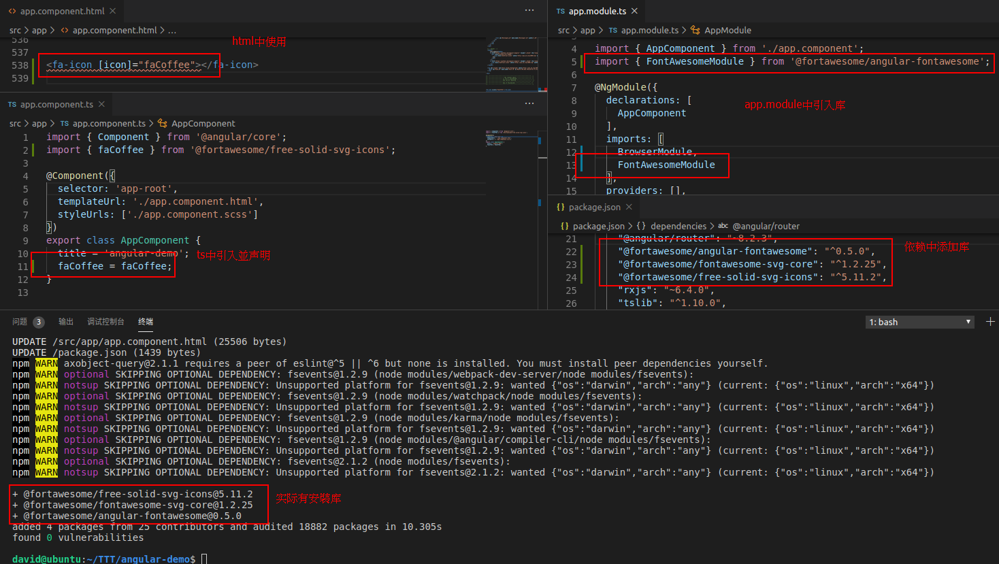

如果到这里都正常，那么恭喜你，自定义原理库实现 ng add 也成功了！

# 4 angular schematics 实现 ng update 更新模块时修改指定组件内容

上面 2 节分别实现了 ng generator 和 ng add，那么接下来就是 ng update 了。  
关于 angular schematics 自定义 ng update 的实践目前网上找的示例都比较少，还不是很清晰。我们这里也会做个实例，但是不会深究。

ng update 有什么用？

> 更新您的应用程序及其依赖项。

如何使用？

> ng update [options]

一般的，如果你的 angular 项目是老旧版本的，运行`ng update`指令，可能就会出现类似以下的内容：

```
Using package manager: 'npm'
Collecting installed dependencies...
Found 33 dependencies.
    We analyzed your package.json, there are some packages to update:

      Name                               Version                  Command to update
     --------------------------------------------------------------------------------
      @angular/cdk                       8.1.4 -> 8.2.3           ng update @angular/cdk
      @angular/cli                       8.3.0 -> 8.3.20          ng update @angular/cli
      @angular/core                      8.2.3 -> 8.2.14          ng update @angular/core
      @angular/material                  8.1.4 -> 8.2.3           ng update @angular/material
      rxjs                               6.4.0 -> 6.5.3           ng update rxjs

```

大家可以仔细看看，这份分析结果说明了什么？  
一共有 33 个依赖，但是只有 5 个可以使用 ng update 升级？  
从哪里看出哪些依赖能用 ng update 升级？各个依赖包的 package.json

ug update 的原理逻辑还是比较复杂了，其实直接看 angular-cli 的升级，比较容易看出端倪。

访问`https://github.com/angular/angular-cli/tree/master/packages/schematics/angular/migrations`，  
查看 migration-collection.json 文件，随意选一个，例如以下：

```
// 上略
   "migration-07": {
      "version": "8.0.0-beta.12",
      "factory": "./update-8",
      "description": "Update an Angular CLI project to version 8."
    },
// 下略
```

看起来大概意思就是，ug update 将 angular 升级到 8.0.0-beta.12 版本时，就会执行`migration-07`的升级相关命令，其工厂函数内容就在 update-8 的文件夹中。

有兴致可以细研究 ng update 到 8.0.0-beta.12 具体做了什么。我们只需要简单知道`migration-07`他会依照相关规则去执行一些动作。

那么，这份`migration-collection.json`是在哪里使用的呢？

可以看到，在这里：`https://github.com/angular/angular-cli/blob/master/packages/angular/cli/package.json`，在 angular-cli 的 package.json 文件中被定义的。

以上只是一些我在知道结果之后抛出来给大家看的关键点，大家可以深入研究。我在这里，就简单写个示例，供分析。

**注意：为了后续 ng update 实际使用效果，在此时进行后续作业前，可见现在的代码备份一下，作为 0.0.1 版本。**版本号的更改当然在 package.json 中。

**本节需要实现的目标是：  
1、本 angular-schematics-tutorial package 在 angular 项目中使用时，可以使用 ng update 进行升级  
2、在升级到指定版本时，能够按照升级需求修改已有 angular 项目中部分规则内容。**

这也是在使用 ng update 升级 angular 项目时，可以看到很多旧版本的写法，他会自动纠正成新版本的写法。

不过，依照我的简单总结，使用 ng update 升级，其实有几点要做：

## 1、创建 migration.json 文件

在 src/文件夹下，与 collection.json 同级目录，新建 migration.json 文件(名字虽然不限制，但是以便识别)，并写入以下内容：

```
{
    "$schema": "../node_modules/@angular-devkit/schematics/collection-schema.json",
    "schematics": {
        "migration002": {
            "version": "0.0.2",
            "description": "更新angular-schematics-tutorial到0.0.2版本时执行的更新",
            "factory": "./ng-update/index#update"
        }
    }
}
```

此份说明，当后续把这个 schematics 项目打包之后，其他 angular 项目中使用了这个包，升级到 0.0.2 版本时，就要执行在/ng-update/index.ts 文件中的逻辑规则更新代码了。

## 2 在 package.json 中声明 ug-update 配置

在 package.json 中，添加以下项目：

```
  "ng-update": {
    "migrations": "./src/migration.json"
  },
```

其作用，就是在执行 ng update 时，能够找到对应的配置文件

## 3 编写更新执行的规则工厂逻辑代码

因为只是简单示例，我简单的实现，如果把此 angular-schematics-tutorial 包升级到了 0.0.2 版本，那么一并更新 app.component.ts 里面的 title 变量的值，为`AngularSchematicsTutorial002`，如果在我之前使用的测试 angular-demo 中运行，可以先看到，目前的 title 值应该是`title = 'angular-demo';`。

在 component 同级文件夹路径下新建 ng-update 文件夹，并添加 index.ts 文件，并添加以下代码：

```
import { Rule, Tree, SchematicContext, SchematicsException } from '@angular-devkit/schematics';
import { buildDefaultPath } from '@schematics/angular/utility/project';
import * as ts from 'typescript';

export function update(): Rule {
    return (_tree: Tree, _context: SchematicContext) => {

        // 解析angular项目
        const workspaceConfigBuffer = _tree.read('angular.json');
        if (!workspaceConfigBuffer) {
            throw new SchematicsException('Not an Angular CLI workspace');
        }

        const workspaceConfig = JSON.parse(workspaceConfigBuffer.toString());
        const projectName = workspaceConfig.defaultProject;
        const project = workspaceConfig.projects[projectName];
        const defaultProjectPath = buildDefaultPath(project);

        // 把 app.component.ts 转成 Typescript AST
        const componentPath = `${defaultProjectPath}/app.component.ts`;
        const componentSourceFile = readIntoSourceFile(_tree, componentPath);

        // 找出 title 变量
        const classDeclaration = componentSourceFile.statements.find(node => ts.isClassDeclaration(node))! as ts.ClassDeclaration;
        const allProperties = classDeclaration.members.filter(node => ts.isPropertyDeclaration(node))! as ts.PropertyDeclaration[];
        const titleProperty = allProperties.find(node => node.name.getText() === 'title');

        // 如果有找到 title 变量，则修改它的值
        if (titleProperty) {
            const initialLiteral = titleProperty.initializer as ts.StringLiteral;

            const componentRecorder = _tree.beginUpdate(componentPath);
            const startPos = initialLiteral.getStart();
            componentRecorder.remove(startPos, initialLiteral.getWidth());
            componentRecorder.insertRight(startPos, '\'AngularSchematicsTutorial002\'');

            _tree.commitUpdate(componentRecorder);
        }

        return _tree;
    }
}

function readIntoSourceFile(host: Tree, modulePath: string): ts.SourceFile {
    const text = host.read(modulePath);
    if (text === null) {
        throw new SchematicsException(`File ${modulePath} does not exist.`);
    }
    const sourceText = text.toString('utf-8');
    return ts.createSourceFile(modulePath, sourceText, ts.ScriptTarget.Latest, true);
}
```

内容可不细看，就是找到 angular 项目中的 app.component.ts，把 title 的值改为 AngularSchematicsTutorial002。

## 4 测试并使用

当然，再次在 ng-update/index.ts 下创建 index_spec.ts 编写测试用例也是 ok 的，源代码中会给出。  
若不用这个麻烦，可以直接在之前的 angular-demo 专案的测试，不过因为是相对路径，则不能直接使用 ng update 了，因为它不知道去哪里判断是不是新版本的更新。

在 angular-demo 中运行：

```
schematics ../angular-schematics-tutorial/src/migration.json:migration002 --debug=false
```

执行之后，应该会得到以下结果：

```
david@ubuntu:~/TTT/angular-demo$ schematics ../angular-schematics-tutorial/src/migration.json:migration002 --debug=false
UPDATE /src/app/app.component.ts (318 bytes)
david@ubuntu:~/TTT/angular-demo$
```

并且，app.component.ts 中`title = 'angular-demo';`变成了`title = 'AngularSchematicsTutorial002';`

如果能够运行成功，说明 angular schematics 构建 ng update 原理图也学习完成。

# 5 将原理图 package 发布并使用

以上在执行时，都是使用相对路径在项目中运行，一点都不专业？那么我们可以把这个 schematics 工具包发布，后续直接使用 ng 指令运行。

## 1 使用 npm link 本地调试

可以在我们的 angular-schematics-tutorial 项目目录下，运行`npm link`指令。
npm link 指令细节可参看https://docs.npmjs.com/cli/link.html
。主要作用就是创建一个全局可访问链接符号。
执行之后得到的效果应该如下：

```
david@ubuntu:~/TTT/angular-schematics-tutorial$ npm link
npm WARN angular-schematics-tutorial@0.0.2 No repository field.

audited 78 packages in 1.031s
found 0 vulnerabilities

/home/david/.nvm/versions/node/v12.6.0/lib/node_modules/angular-schematics-tutorial -> /home/david/TTT/angular-schematics-tutorial
david@ubuntu:~/TTT/angular-schematics-tutorial$
```

然后在模板 angular 项目中，链接刚刚的全局 angular-schematics-tutorial 链接。
`npm link angular-schematics-tutorial`，相当于在当前项目安装了之前 link 的包，然后就可以在 angular 项目中直接使用 ng g <collection> 或 ng add <collection>了。

例如在 angular-demo 项目中 link angular-schematics-tutorial ，应该如下：

```
david@ubuntu:~/TTT/angular-demo$ npm link angular-schematics-tutorial
/home/david/TTT/angular-demo/node_modules/angular-schematics-tutorial -> /home/david/.nvm/versions/node/v12.6.0/lib/node_modules/angular-schematics-tutorial -> /home/david/TTT/angular-schematics-tutorial
david@ubuntu:~/TTT/angular-demo$
```

然后使用 ng generator：

```
david@ubuntu:~/TTT/angular-demo$ ng g angular-schematics-tutorial:component
? 你想创建的component的名字: comp/pie
CREATE src/app/comp/pie/pie.component.html (21 bytes)
CREATE src/app/comp/pie/pie.component.scss (0 bytes)
CREATE src/app/comp/pie/pie.component.spec.ts (741 bytes)
CREATE src/app/comp/pie/pie.component.ts (259 bytes)
david@ubuntu:~/TTT/angular-demo$
```

**注意：现在不用设置 --debug=false 属性，一样会直接真实创建了。**

同理，使用 ng add angular-schematics-tutorial：

```shell
david@ubuntu:~/TTT/angular-demo$ ng add angular-schematics-tutorial
Skipping installation: Package already installed
UPDATE src/app/app.module.ts (407 bytes)
UPDATE src/app/app.component.ts (302 bytes)
UPDATE src/app/app.component.html (25506 bytes)
UPDATE package.json (1439 bytes)
npm WARN axobject-query@2.1.1 requires a peer of eslint@^5 || ^6 but none is installed. You must install peer dependencies yourself.
……
省略了一些npm WARN
……
npm WARN notsup SKIPPING OPTIONAL DEPENDENCY: Unsupported platform for fsevents@2.1.2: wanted {"os":"darwin","arch":"any"} (current: {"os":"linux","arch":"x64"})

+ @fortawesome/free-solid-svg-icons@5.11.2
+ @fortawesome/fontawesome-svg-core@1.2.25
+ @fortawesome/angular-fontawesome@0.5.0
added 4 packages from 25 contributors, removed 1 package and audited 18882 packages in 11.067s
found 0 vulnerabilities

david@ubuntu:~/TTT/angular-demo$
```

注意：如果之前执行过，最好撤销后再试。
看到上面显示这一句`Skipping installation: Package already installed`，这里 already installed 的 package 指的是 angular-schematics-tutorial，原因在于我们使用 npm link angular-schematics-tutorial 已经做了链接了。

**那么，能否直接测试 ng update 呢？目前我是没有成功的。**因为 npm link 无法同时测试两个版本？这点可请大家指出。

注意，测试完了请使用 npm unlink 去清除那些链接，避免混乱等情况。

## 2 将原理图 package 发布到仓库并使用

写在前面：如果觉得这样的糟粕不想自己发布用于测试，可以直接使用我已发布的进行测试。
先安装 0.0.1 版本：`npm i angular-schematics-tutorial@0.0.1`
然后执行`ng update`，查看是否生效。

一般如果公司有自己内部的包管理系统，那么就可以直接发布到内部去。  
如何搭建私有 npm 仓库？我之前有文件，使用 verdaccio。

我们这里示例将包发布到公网的 npmjs.com 去。既然是 npmjs，那可能你要去注册个帐号了。

记得前面我们有备份一个 0.0.1 版本的 angular-schematics-tutorial 吗？我们先来发布它。

### 1、添加帐号，在终端输入 adduser，按提示填写

```
david@ubuntu:~/TTT/angular-schematics-tutorial$ npm adduser
Username: davidsu
Password:
Email: (this IS public) 183318××××@qq.com
Logged in as davidsu on https://registry.npmjs.org/.
david@ubuntu:~/TTT/angular-schematics-tutorial$
```

logged in 表示成功

### 2、在根目录执行`npm publish`

得到结果如下：

```
david@ubuntu:~/TTT/angular-schematics-tutorial$ npm publish
npm notice
npm notice 📦  angular-schematics-tutorial@0.0.1
npm notice === Tarball Contents ===
……
略一大部分 npm notice 内容
……
npm notice === Tarball Details ===
npm notice name:          angular-schematics-tutorial
npm notice version:       0.0.1
npm notice package size:  11.3 kB
npm notice unpacked size: 41.2 kB
npm notice shasum:        9f80b36542065cafb2eb06a5eceb068d5aa9db44
npm notice integrity:     sha512-oZcVhqatHlU9K[...]Qz7Deicn1f3oA==
npm notice total files:   34
npm notice
+ angular-schematics-tutorial@0.0.1
david@ubuntu:~/TTT/angular-schematics-tutorial$
```

那么没有添加 ng update 的 0.0.1 版本就发布了，可以在 npmjs 网站自己的账户下查看自己发布的包。

### 3 发布 0.0.2 版本的包

重复以上动作(npm publish)，把 angular-schematics-tutorial 的 0.0.2 版本的包也发布了，那么就可以看到自己两个版本的包了。
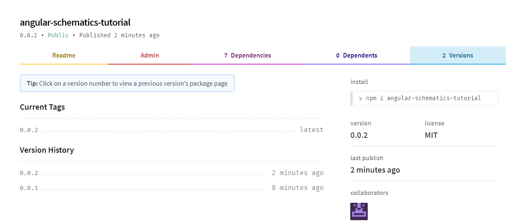

### 4 实际测试使用

现在，我们的 angular-schematics-tutorial 时就是一个可以被所有人访问的原理图工具包了，那么我们就可以想实际使用包一样去测试它了。

为了避免干扰，可以删除之前的 angular-demo 测试项目，新建一个 angular-test 的新项目

```
ng new angular-test
```

我们先测试 ug update 的效果。

先安装 0.0.1 版本：

```
npm i angular-schematics-tutorial@0.0.1
```

然后运行`ng update`指令，应该看到以下内容

```
david@ubuntu:~/TTT/angular-test$ ng update
Using package manager: 'npm'
Collecting installed dependencies...
Found 31 dependencies.
    We analyzed your package.json, there are some packages to update:

      Name                               Version                  Command to update
     --------------------------------------------------------------------------------
      angular-schematics-tutorial        0.0.1 -> 0.0.2           ng update angular-schematics-tutorial
      rxjs                               6.4.0 -> 6.5.3           ng update rxjs
david@ubuntu:~/TTT/angular-test$
```

现在，我们可以直接使用 ng update 去升级我们的工具包了。  
**注意：使用 ng update 升级前，要提交所有变更。**
运行`ng update angular-schematics-tutorial`，注意查看 app.component.ts 中 title 变量是否变化：

```
david@ubuntu:~/TTT/angular-test$ ng update angular-schematics-tutorial
Using package manager: 'npm'
Collecting installed dependencies...
Found 31 dependencies.
Fetching dependency metadata from registry...
    Updating package.json with dependency angular-schematics-tutorial @ "0.0.2" (was "0.0.1")...
UPDATE package.json (1329 bytes)
npm WARN axobject-query@2.1.1 requires a peer of eslint@^5 || ^6 but none is installed. You must install peer
……
省略一些npm WARN
……
npm WARN notsup SKIPPING OPTIONAL DEPENDENCY: Unsupported platform for fsevents@2.1.2: wanted {"os":"darwin","arch":"any"} (current: {"os":"linux","arch":"x64"})

updated 1 package and audited 18955 packages in 8.615s
found 0 vulnerabilities

    ** Executing migrations for package 'angular-schematics-tutorial' **
UPDATE src/app/app.component.ts (233 bytes)
david@ubuntu:~/TTT/angular-test$
```

从最后一行，看到，应该是修改了，实际也如此。


其他的 ng generator 的原理图和 ng add 的原理图也是可以的，可以自行测试。
例如：`ng g angular-schematics-tutorial:crudService`或者`ng add angular-schematics-tutorial`

# 总结

花费了如此大量的篇幅，基本上讲清楚了 angular schematics 的基本使用内容。虽然看起来很鸡肋，但是如果是 angular 技术栈并且长期有重复大量相同工作的开发，不免可以试一下使用它来重构下作业流程。虽然不一定比 ctrl+c ctrl+v 快，但是至少逼格更高了。

总结一下使用 angular schematics 的步骤重点。

制作 ng generator 或 ng add 原理图：  
1、新建原理图使用模板文件；  
2、创建该原理图需要的 schema.json 并将该原理图配置到 collection.json；  
3、依照 schema.json 创建接口 schema.d.ts；  
4、在 index.ts 中编写实现该原理图目的的逻辑代码；  
5(非必须)、编写测试用例进行测试；  
6(测试)、利用测试用例或实际项目进行测试。

添加 ng update  
1、创建并编写 migration.json 文件；  
2、在 package.json 中声明 ug-update 配置；  
3、编写更新执行的规则工厂逻辑代码；  
4、测试并使用。

以上内容亲测有效，有问题可提出交流，谢谢。

主要参考：  
https://ithelp.ithome.com.tw/articles/10222826  
https://medium.com/@tomastrajan/total-guide-to-custom-angular-schematics-5c50cf90cdb4  
和 angular 官方文档：https://angular.cn/guide/schematics
